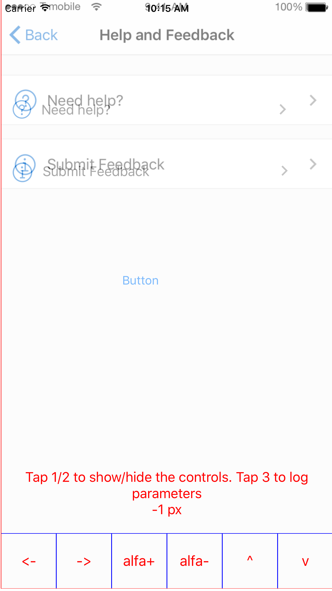
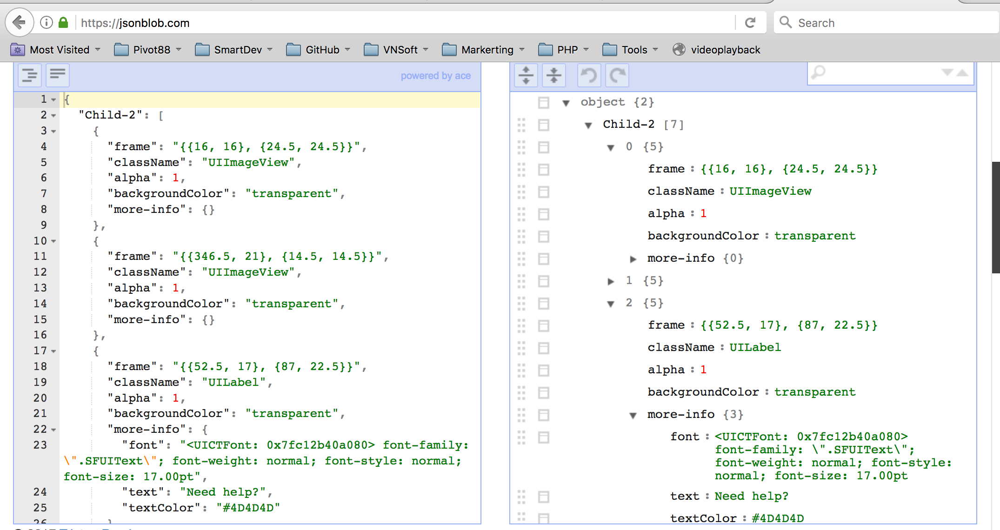

This is sample class which help the developers debug UI in easy way
===================================================================
* How to use : Just import class UIViewController+DebugUI.h & call method addDebugScreen
```objective-c
    [self addDebugScreen:@"help-and-feedback.png"];
```




* Here is the parameters of views in this controller
https://jsonblob.com/3e257188-fef6-11e6-a0ba-e591c58c3fb2



* I hope this can help you to know which & how to adjust the elements according design.
